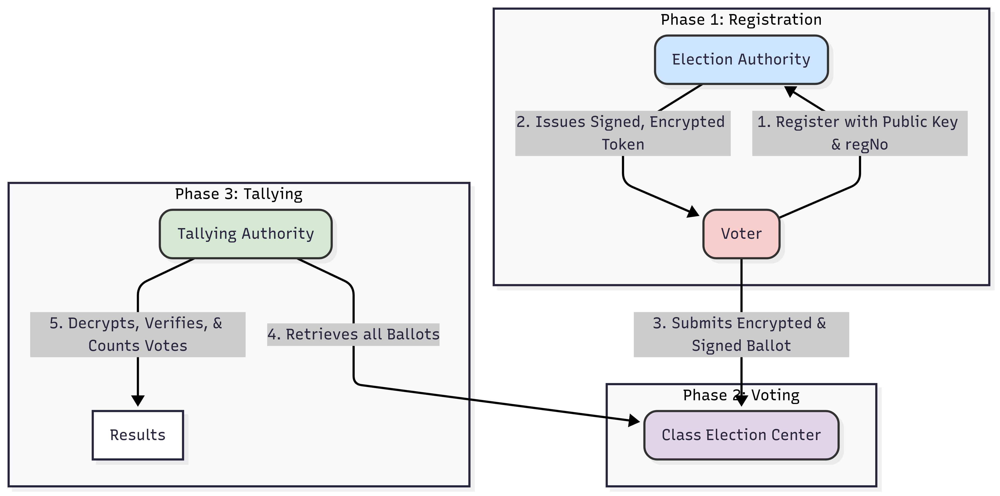

# Secure Class Voting System

This project is a Java-based simulation of a secure electronic voting system designed for small-scale elections, such as for a class representative. It implements a robust cryptographic protocol to ensure voter anonymity, ballot integrity, and election verifiability, while preventing common attacks like double-voting and ballot tampering.

## Table of Contents

- [Core Concepts & Security Features](#core-concepts--security-features)
- [Architectural Design](#architectural-design)
- [Cryptographic Workflow](#cryptographic-workflow)
  - [1. Registration & Token Issuance](#1-registration--token-issuance)
  - [2. Voting & Ballot Submission](#2-voting--ballot-submission)
  - [3. Vote Tallying](#3-vote-tallying)
- [Project Structure](#project-structure)
- [Getting Started](#getting-started)
  - [Prerequisites](#prerequisites)
  - [Compilation & Execution](#compilation--execution)
- [Simulation Walkthrough](#simulation-walkthrough)
- [Key Technologies & Algorithms](#key-technologies--algorithms)
- [Limitations](#limitations)

## Core Concepts & Security Features

The system's security is built on the principle of **separation of duties** between different authorities, ensuring that no single entity can compromise the entire election.

- **Anonymity**: The **Election Authority (EA)** knows who is eligible to vote, while the **Tallying Authority (TA)** knows what the votes are. Crucially, the EA does not see the votes, and the TA does not see the voter identities. This link is broken by the use of anonymous, single-use tokens.
- **Integrity**: Ballots are digitally signed by voters with their private keys. This guarantees that a ballot has not been tampered with after it was cast.
- **Confidentiality**: Votes are encrypted using a hybrid encryption scheme (RSA + AES). Only the Tallying Authority, with its private key, can decrypt and read the final votes.
- **Eligibility Uniqueness**: The EA ensures that only registered individuals can receive a voting token. The TA prevents double-voting by maintaining a list of used tokens and discarding any duplicates, effectively mitigating replay attacks.

## Architectural Design

The system is composed of four main components that interact to facilitate a secure election:

1. **Election Authority (EA)**: Responsible for registering voters and issuing anonymous, digitally signed voting tokens.
2. **Tallying Authority (TA)**: Responsible for decrypting, verifying, and counting the votes. It has its own key pair and is the only entity that can read the cast votes.
3. **Class Election Center**: A public, transparent "bulletin board" where voters post their encrypted and signed ballots. It acts as a passive intermediary.
4. **Voter**: An individual who registers with the EA to get a token and then casts their encrypted vote at the Election Center.

The interaction between these components is illustrated below:

